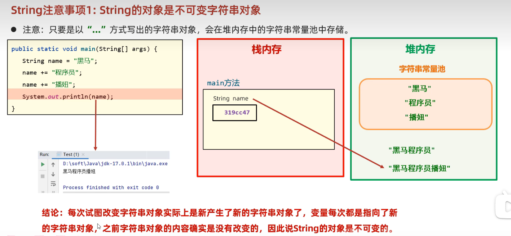
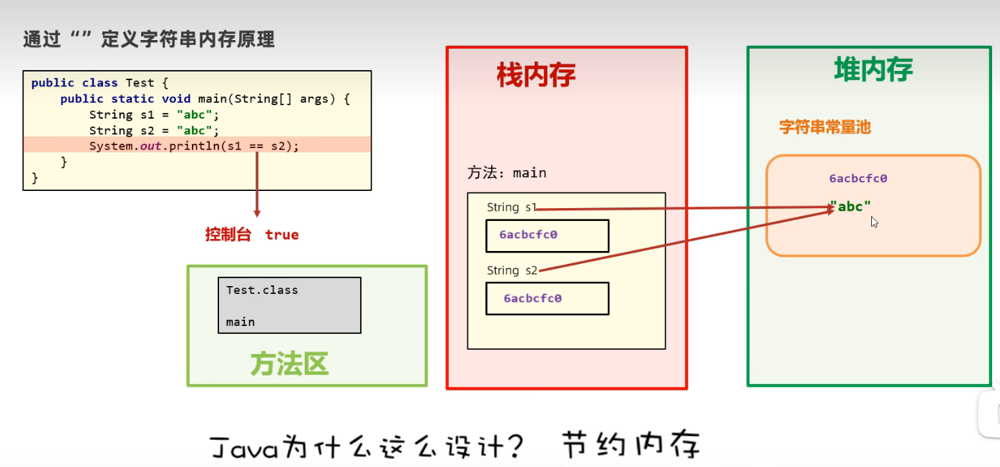
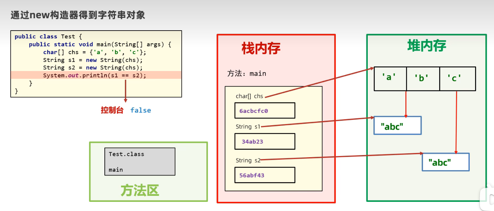
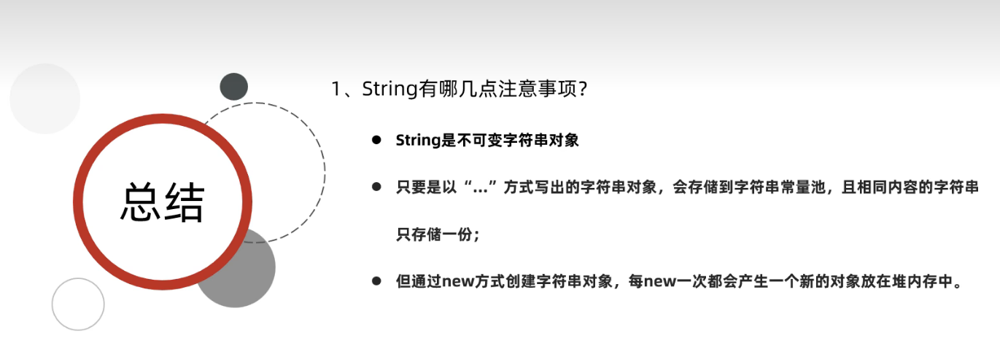
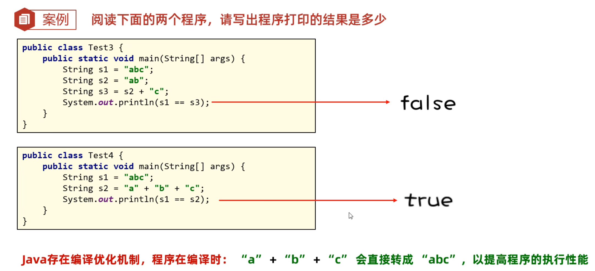
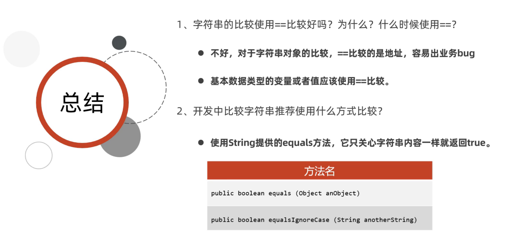
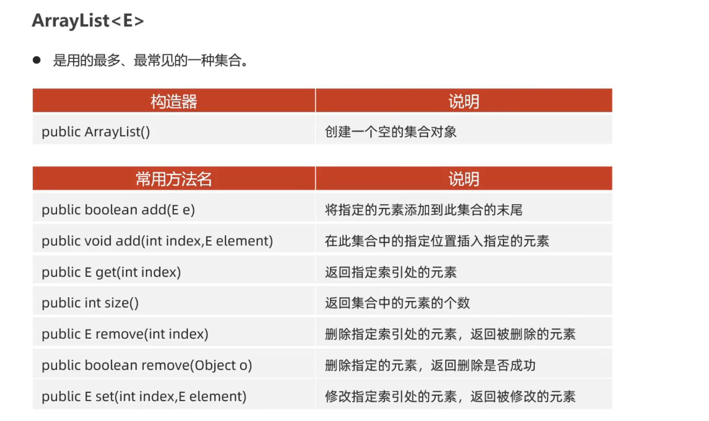

# 《Java 面向对象编程》

***

## 面向对象基础：

### 一、String部分

#### 1、String常用API

```java
String s = "gmm is a pig";

// 1、提取字符串中某个索引位置的字符
char c = s.charAt(1);

// 2、把字符串转换成字符数组
char[] chars = s.toCharArray();

// 3、判断字符串内容是否相等
c1.equals(c2) // true or false
c1.equalsIgnoreCase(c2) // 忽略大小写
    
// 4、截取字符串内容
c3.substring(0,8) // 截取0-8位置的字符串
c3.substring(5) // 截取5位置以后的字符串
    
// 5、替换字符串中的内容
c4.replace("意义", "**") // 把所有的意义替换成**
    
// 6、判断是否包含某个关键字
c5.contains("Java") // 严格判断，区分大小写
    
// 7、判断字符串是否以某个字符串开头
c6.startsWith("张三")
    
// 8、把字符串按照某个指定内容分割成多个字符串，放到一个字符串数组返回
String res = "张三，李四，王五";
String[] names = res.split("，");
```

#### 2、String的注意事项

> **1、String的对象是不可变字符串对象**
>
> 
>
> **2、通过" "定义相同字符串，存储的是同一字符串的地址**
>
> 
>
> **3、通过new构造器**
>
> 

##### 总结：



##### 案例：





### 二、ArrayList集合

**集合：**集合是一种容器，用来装数据的，类似于数组。

**特点：**集合大小可变，开发中用的更多。

#### 1、ArrayList常用API



## 面向对象高级：

